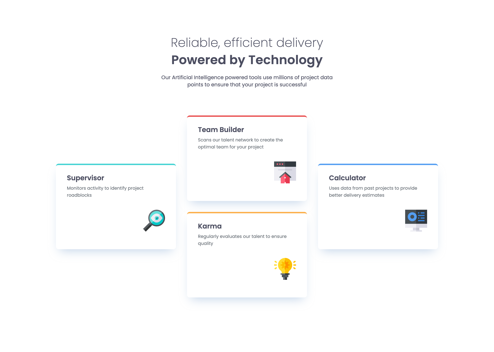

# 🌐 Frontend Mentor - Four card feture section

This is a solution to the [Four card feature section](https://www.frontendmentor.io/challenges/four-card-feature-section-weK1eFYK).  
Frontend Mentor challenges help you improve your coding skills by building realistic projects. 💻🚀

---

## 📑 Table of Contents

- [🔍 Overview](#-overview)
  - [🖼️ Screenshot](#-screenshot)
  - [🔗 Links](#-links)
- [🛠️ My Process](#-my-process)
  - [🧱 Built With](#-built-with)
  - [📚 What I Learned](#-what-i-learned)
  - [🔄 Continued Development](#-continued-development)
- [👤 Author](#-author)

---

## 🔍 Overview

### 🖼️ Screenshot

### 🔗 Links

- 💡 Solution URL: [My solution for Four card feature section challenge]()
- 🌐 Live Site URL: [Four card faeture section live](https://danijel374.github.io/fem-four-card-feature-section/)

---

## 🛠️ My Process

Before jumping into the code, I took a moment to plan things out. Thinking through the layout and structure helped me write cleaner and more organized code. ✍️🧠

### 🧱 Built With

- ✅ Semantic HTML5 markup
- 🎨 CSS custom properties
- 🧩 BEM naming convention
- 📐 Flexbox
- 🧱 CSS Grid
- 📱 Mobile-first workflow

### 📚 What I Learned

This was my third Frontend Mentor challenge. While similar to the first five, it helped reinforce the fundamentals of HTML and CSS. Nothing new in particular this time, but solid practice nonetheless! 💪

### 🔄 Continued Development

I'm focusing more on:

- Improving my responsive design skills
- Mastering layout techniques

---

## 👤 Author

- 🧑‍💻 Frontend Mentor - [@danijel374](https://www.frontendmentor.io/profile/danijel374)
- 🐦 Twitter - [@danijel3741](https://www.twitter.com/danijel3741)

---

Thanks for checking out my solution! 😊
